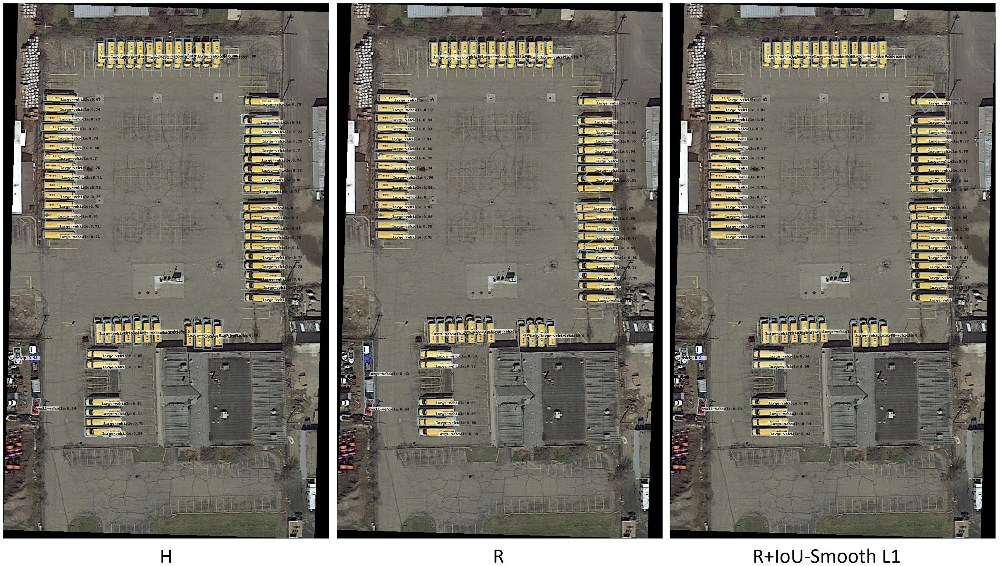
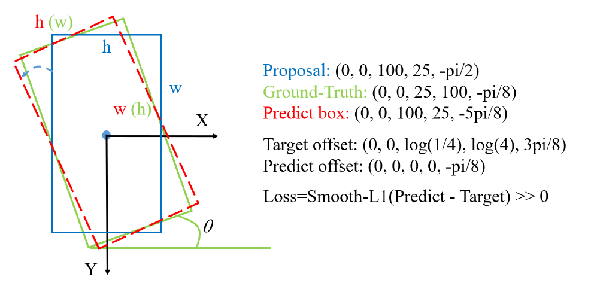
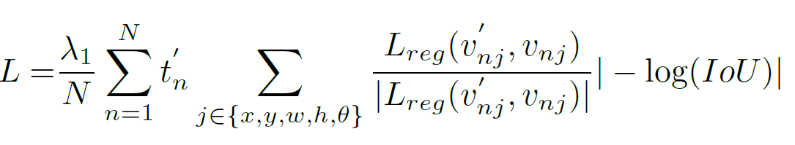
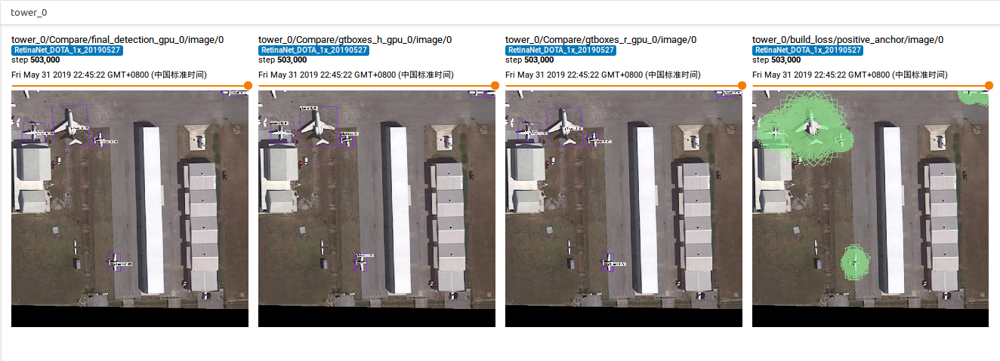
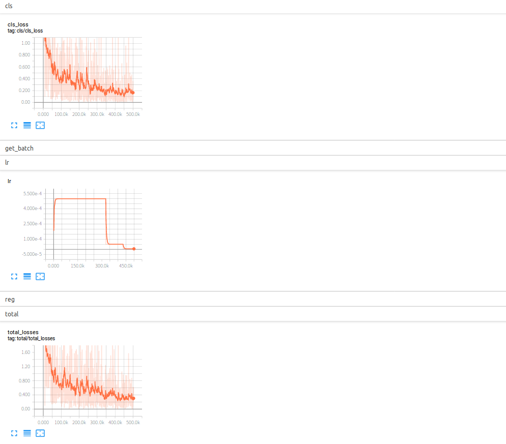

# Focal Loss for Dense Rotation Object Detection

## Abstract
This repo is based on [Focal Loss for Dense Object Detection](https://arxiv.org/pdf/1708.02002.pdf), and it is completed by [YangXue](https://github.com/yangxue0827).    

**We also recommend a tensorflow-based [rotation detection benchmark](https://github.com/yangxue0827/RotationDetection), which is led by [YangXue](https://yangxue0827.github.io/).**

## Performance
### DOTA1.0
| Model |    Backbone    |    Training data    |    Val data    |    mAP   | Model Link | Anchor | Reg. Loss| Angle Range | lr schd | Data Augmentation | GPU | Image/GPU | Configs |      
|:------------:|:------------:|:------------:|:---------:|:-----------:|:----------:|:-----------:|:-----------:|:---------:|:---------:|:---------:|:---------:|:---------:|:---------:|    
| RetinaNet | ResNet50_v1d 600->800 | DOTA1.0 trainval | DOTA1.0 test | 63.18 | [model](https://drive.google.com/file/d/18Z3NWhL4gQB5yJLCXBcHBnK-6BPle3m1/view?usp=sharing) | H | smooth L1 | 90 | 1x | No |**1X** GeForce RTX 2080 Ti | 1 | cfgs_res50_dota_v4.py |     
| RetinaNet | ResNet50_v1d 600->800 | DOTA1.0 trainval | DOTA1.0 test | 64.10 | - | H | smooth L1 | **180** | 1x | No | 1X GeForce RTX 2080 Ti | 1 | cfgs_res50_dota_v15.py |     
|  |  |  |  |  |  |  |  |  |  |  |  |  |
| RetinaNet | ResNet50_v1d 600->800 | DOTA1.0 trainval | DOTA1.0 test | 62.76 | [model](https://drive.google.com/file/d/1n0O6qLJjdDewb_9FDgsGkISevL7SLD8_/view?usp=sharing) | R | smooth L1 | 90 | 1x | No | 1X GeForce RTX 2080 Ti | 1 | cfgs_res50_dota_v1.py |
| RetinaNet | ResNet50_v1d 600->800 | DOTA1.0 trainval | DOTA1.0 test | 68.65 | - | R | [**iou-smooth L1**](https://arxiv.org/abs/1811.07126) | 90 | 1x | No | 1X GeForce RTX 2080 Ti | 1 | cfgs_res50_dota_v5.py |    
  
**Notice:**    
**Due to the improvement of the code, the performance of this repo is gradually improving, so the experimental results in configuration files are for reference only.**        
**This repo has basically stopped updating, please refer to [new repo](https://github.com/Thinklab-SJTU/R3Det_Tensorflow) for the latest progress.**

### Visualization



## My Development Environment
**docker images: docker pull yangxue2docker/yx-tf-det:tensorflow1.13.1-cuda10-gpu-py3**      
1、python3.5 (anaconda recommend)               
2、cuda 10.0                     
3、[opencv(cv2)](https://pypi.org/project/opencv-python/)       
4、[tfplot 0.2.0](https://github.com/wookayin/tensorflow-plot) (optional)            
5、tensorflow 1.13       
              
## IoU-smooth L1 Loss
**[SCRDet: Towards More Robust Detection for Small, Cluttered and Rotated Objects (ICCV2019)](https://arxiv.org/abs/1811.07126)**    



             

## Download Model
### Pretrain weights
1、Please download [resnet50_v1](http://download.tensorflow.org/models/resnet_v1_50_2016_08_28.tar.gz), [resnet101_v1](http://download.tensorflow.org/models/resnet_v1_101_2016_08_28.tar.gz) pre-trained models on Imagenet, put it to data/pretrained_weights.       
2、**(Recommend in this repo)** Or you can choose to use a better backbone, refer to [gluon2TF](https://github.com/yangJirui/gluon2TF).    
* [Baidu Drive](https://pan.baidu.com/s/1GpqKg0dOaaWmwshvv1qWGg), password: 5ht9.          
* [Google Drive](https://drive.google.com/drive/folders/1BM8ffn1WnsRRb5RcuAcyJAHX8NS2M1Gz?usp=sharing)      

## Compile
```  
cd $PATH_ROOT/libs/box_utils/cython_utils
python setup.py build_ext --inplace (or make)

cd $PATH_ROOT/libs/box_utils/
python setup.py build_ext --inplace
```

## Train

1、If you want to train your own data, please note:  
```     
(1) Modify parameters (such as CLASS_NUM, DATASET_NAME, VERSION, etc.) in $PATH_ROOT/libs/configs/cfgs.py
(2) Add category information in $PATH_ROOT/libs/label_name_dict/label_dict.py     
(3) Add data_name to $PATH_ROOT/data/io/read_tfrecord.py 
```     

2、Make tfrecord     
For DOTA dataset:      
```  
cd $PATH_ROOT\data\io\DOTA
python data_crop.py
```  

```  
cd $PATH_ROOT/data/io/  
python convert_data_to_tfrecord.py --VOC_dir='/PATH/TO/DOTA/' 
                                   --xml_dir='labeltxt'
                                   --image_dir='images'
                                   --save_name='train' 
                                   --img_format='.png' 
                                   --dataset='DOTA'
```      

3、Multi-gpu train
```  
cd $PATH_ROOT/tools
python multi_gpu_train.py
```

## Test
```  
cd $PATH_ROOT/tools
python test_dota.py --test_dir='/PATH/TO/IMAGES/'  
                    --gpus=0,1,2,3,4,5,6,7          
``` 

**Notice: In order to set the breakpoint conveniently, the read and write mode of the file is' a+'. If the model of the same #VERSION needs to be tested again, the original test results need to be deleted.**      

## Tensorboard
```  
cd $PATH_ROOT/output/summary
tensorboard --logdir=.
``` 





## Reference
1、https://github.com/endernewton/tf-faster-rcnn   
2、https://github.com/zengarden/light_head_rcnn   
3、https://github.com/tensorflow/models/tree/master/research/object_detection    
4、https://github.com/fizyr/keras-retinanet     


